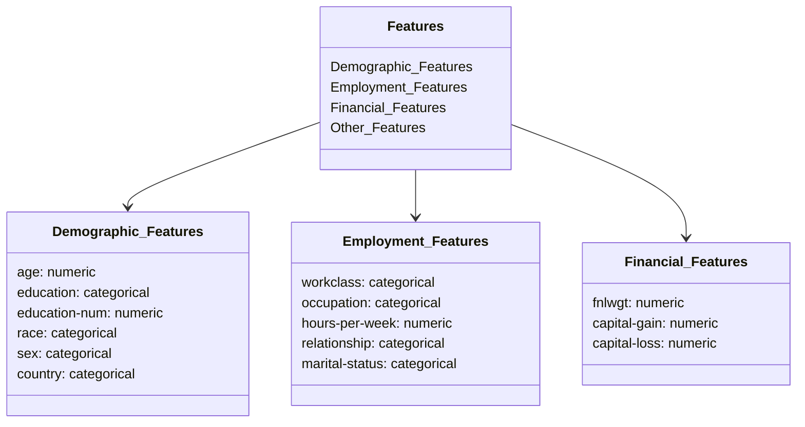
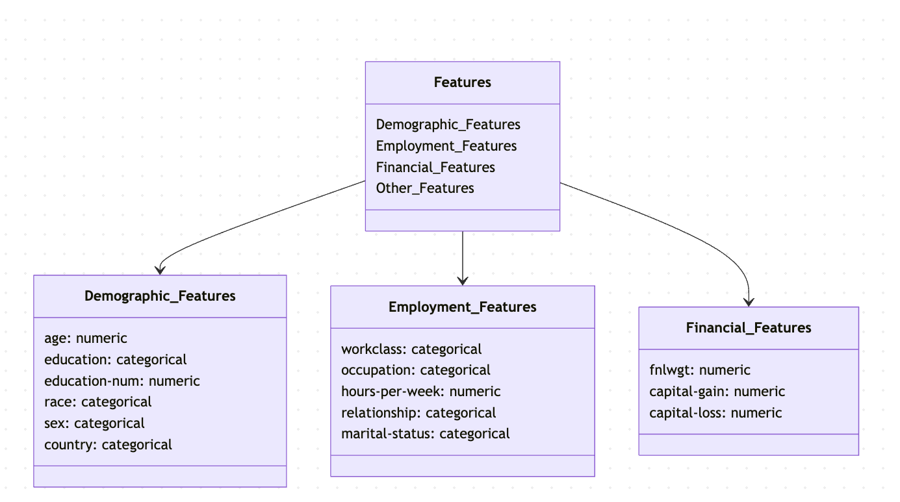

# Modular-Workflow-and-Project-Setup-Basics
# Problem Statement:
## Business Context:
The project aims to develop a machine learning system that pr
edicts individual income levels based on demographic and empl
oyment data.

The prediction boundary is set at $50,000 annually (binary cl
assification problem).
The solution will help in understanding socio-economic factor
s affecting income levels.
Enable data-driven decision making for policy makers and fina
ncial institutions.
Identify key socio-economic factors influencing income dispar
ities.
Support targeted intervention programs for economic developme
nt
## Key Stakeholders
**Policy Makers:** For evidence-based policy development
**Financial Institutions:** For risk assessment and product d
evelopment
**Social Services:** For resource allocation and program plan
ning
**Research Organizations:** For socio-economic studies
# Dataset Details:
Let's visualize the data structure and features:

